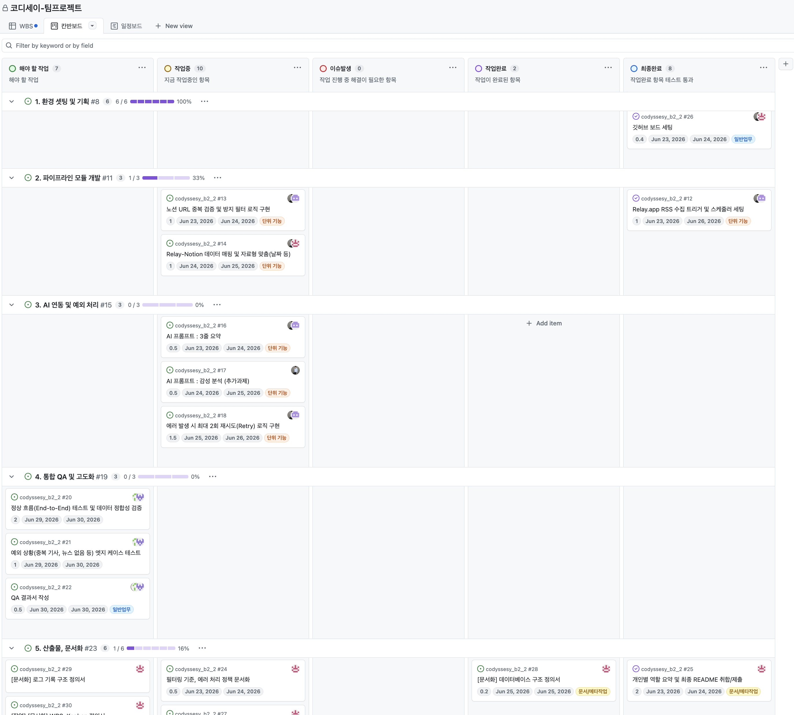

# Kanban 화면 정의

## 칸반 사용 목적

* 애자일하게 돌아가는 파편화된 업무를 시각화함
* 각 참여자와 업무 현재 상태에 대해 분명하게 볼 수 있도록 함
* 무엇이 중요한가, 어디에 인력을 투입해야 하는가에 대한 의사결정 가속화 지원

## URL : [칸반 링크](https://github.com/orgs/codyssey16/projects/7/views/2?filterQuery=&groupedBy%5BcolumnId%5D=&visibleFields=%5B%22Title%22%2C%22Assignees%22%2C%22Status%22%2C%22Linked+pull+requests%22%2C%22Sub-issues+progress%22%5D)

## 화면 예시 
