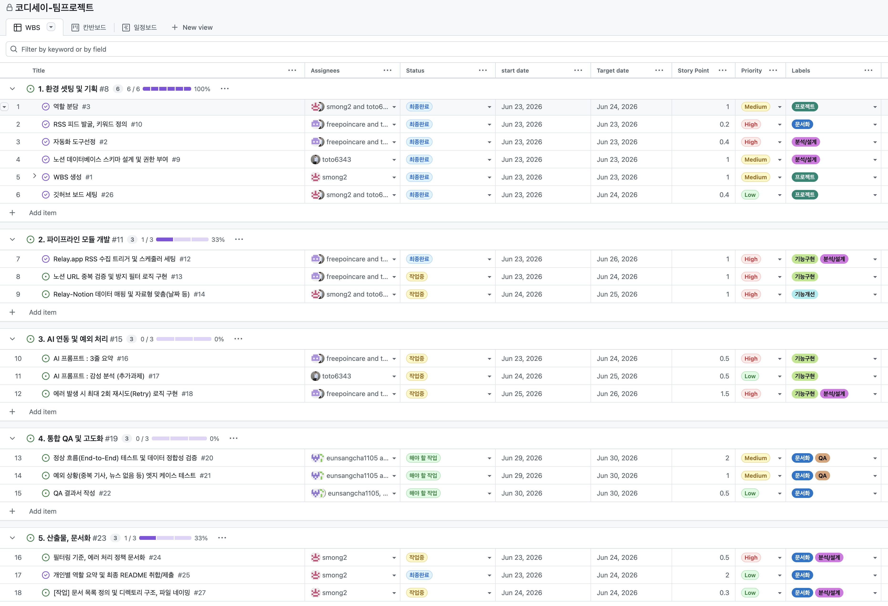

# WBS 화면 정의

## URL : [WBS 링크](https://github.com/orgs/codyssey16/projects/7/views/1)

## 사용목적
* 프로젝트를 실행 가능한 최소 작업 단위로 분해
* 막연한 추측을 구체적인 데이터로 전환하여 프로젝트의 실체를 파악할 수 있게 함
* 작업기간, 멤버들이 한자리에 모이지 못하는 상황이기에 본인의 역할과 진행 상황을 보기 쉽게 하기 위함
* 일정 지연 구간을 확인하여 어떤 작업, 어떤 작업자에 리스크가 발생했는지도 확인하고 업무 지원할 수 있게 함
* 본래 목적은 책임소재로 만들어진 기법이지만, 본 프로젝트에서는 협업 관점에서 WBS를 설계하고 관리하기로 함.

## WBS 구조 (2 depth)
* 과업을 작업 성격에 따라 task 로 분류하고 그 아래 하위 이슈를 생성.
* 하위 이슈는 과업 리스트과 같은 단계에 있는 내용을 사용

## 주요 항목 설명 
* story point : 업무의 크기를 나타낸 것으로, 애자일 기법 스프린트를 수행할 때 사용하는 업무 규모 표시단위 (1 sp = 1md)
* priority : 업무의 긴급도. 빨리 처리해야 하거나 중요한 업무
* start_date, target_date : 시작일과, 종료 예정일

    | 항목명    | 설명 | 종류 | 활용내용 |
    | :----- | :--------: | :------: | ----: |
    | Title | 이슈명 | 이슈   하위이슈   마일스톤 | 과업을 작업단위로 세분화함   2 depth 를 사용하여 grouping 함   하위이슈 생성을 통한 애자일한 업무 가능 |
    | Assignees | 업무 담당자 | 담당자, 협조자 | 단독으로 업무를 처리하는 것이 아니라 페어로 작업   작업 과정, 결과의 신뢰도 향상 |
    | Status | 이슈 상태 | 해야 할 작업   작업중   작업완료   최종완료   이슈발생 | 현재 작업 상태를 확인하고 진행도를 파악하는 중요한 지표로 활용 |
    | Start_date   Target_date | 시작일 종료예정일 | 날짜 | 시작, 종료 예정일로 마일스톤의 최종 종료를 예측하고 리스크 예측에 난이도를 낮춤 |
    | Story Point |  작업규모 | 숫자 | 1 SP = 1md   하루 업무량 1 을 기준으로 설정 |
    | Priority | 우선순위 | low   medium   high   urgent | 애자일은 특성상 동시에 작업이 많이 수행 되는데, 그에 있어 의사결정에 도움을 주기 위함 |
    | Labels | 태그 | 문서화, 기능구현 등 | 해당 작업이 어떤 분류인지 확인하고, 작업 간 문서 또는 작업 검색시 활용 |
 