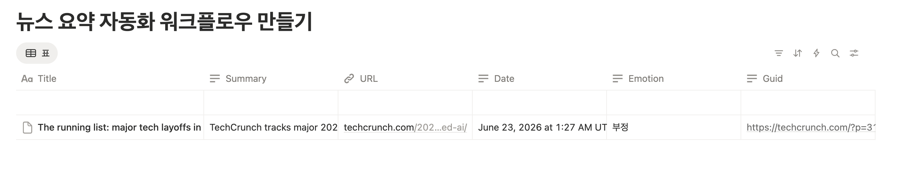

# 데이터베이스 구조 정의 및 데이터 예시

* **데이터베이스 : 노션**

1. 뉴스 Feed 테이블 (뉴스 요약 자동화 워크플로우 만들기)

* https://app.notion.com/p/388b40a9099b803a9ebaf8c67768bcdf?v=388b40a9099b8097aad8000c3e7a5089

* 스키마

    | 컬럼명 | 타입 | 설명 |
    | :-- | :--:  | --: |
    | Title  | text  | 기사 주제 |
    | Summary  | text  | 3줄 요약 |
    | URL  | text  | URL 정보 
    | Date  | datetime  | 기사 등록시각 |  
    | Emotion  | text  | enum(긍정,부정)  |  
    | Guid  | text  | Guid 고유키값 |  

---
2. 데이터 예시
* 시간 표현 값은 바뀌어야 함

    

---