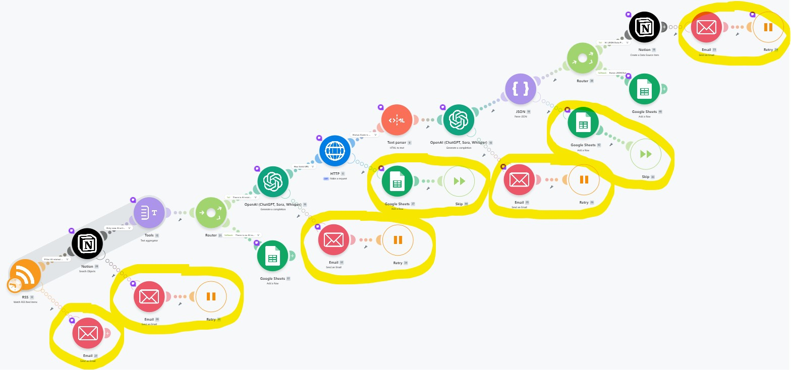
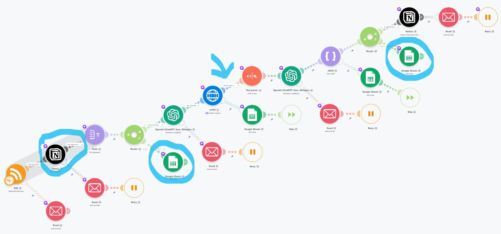

# ⚠️ 에러 처리 정책 및 선택 이유

본 워크플로우는 **1) 즉각 조치가 필요한 핵심 모듈(RSS, OpenAI, Notion)은 이메일 알림 및 재시도(Retry)** 정책을 적용하고, **2) 시스템 연속성이 중요한 모듈(HTTP, JSON)은 구글 시트 기록 및 스킵(Skip)** 정책을 적용하는 등 에러의 치명도에 따라 대응 프로세스를 다각화하였다.

또한, 라우터(Router)와 필터(Filter)를 적재적소에 배치하여 문법적 오류(System Error)와 데이터 정제 오류(Business Logic Issue)를 분리 대응하도록 구현하였다.

## ⚙️ 에러 처리 정책 및 선택 이유 일람표 (시스템 에러 대응)

| 분류 | 대상 모듈 | 에러/이슈 상황 및 테스트 케이스 | 대응 정책 (Error Handling) | 대응 방식 선택 이유 (실무적 근거) |
| --- | --- | --- | --- | --- |
| **시스템 에러** | **[RSS]** | RSS 피드 URL이 존재하지 않을 경우; 예를 들어 `https://.../fe`와 같이 잘못된 주소로 테스트 | 관리자 **Email 즉시 알림** 발송 | 데이터 수집의 시작점인 RSS 모듈이 작동하지 않으면 전체 파이프라인이 중단되므로, 관리자가 인지하고 즉각 조치할 수 있도록 이메일 알림을 설정함. |
| **시스템 에러** | **[Notion]** (1, 2차) | 타임아웃, 노션 저장 에러, 연동 에러 등; Data Source ID(데이터베이스 ID)가 존재하지 않아 노션 연동에 실패한 경우 테스트 | 관리자 **Email 알림** 발송 후 **`Retry(재시도)`** | 노션 API 장애나 일시적인 서버 불안정으로 인한 데이터 유실을 막기 위해 관리자에게 알림을 보냄과 동시에 재시도를 수행하여 데이터 적재 안정성을 확보함. |
| **시스템 에러** | **[OpenAI]** (1, 2차) | API 키 만료, 토큰 부족, 프롬프트 규격 오류, 연동 에러 등; 존재하지 않는 GPT 모델명을 강제로 입력하여 테스트 (예: `gpt-fake-model-12345`) | 관리자 **Email 알림** 발송 후 **`Retry(재시도)`** | LLM API 에러는 일시적인 할당량 초과나 타임아웃일 확률이 높으므로, 즉시 종료하기보다 시간 차를 두고 재시도하여 뉴스 요약 업무의 연속성을 유지함. |
| **시스템 에러** | **[HTTP]** | 뉴스 원문 스크래핑 시 잘못된 URL이 전달된 경우 (예: [https://doesntexist.com](https://doesntexist.com)) | Google Sheets에 로그 생성 후 **`Skip`** 처리 | 특정 뉴스 사이트의 서버 다운이나 링크 만료는 인프라 전체의 치명적인 에러가 아니므로, 시스템을 중단시키지 않고 구글 시트에 이력을 남김. |
| **시스템 에러** | **[Parse JSON]** | OpenAI가 반환한 결과물이 올바른 JSON 형식이 아닐 경우; 예를 들어 `not-json-you-want` 입력하여 테스트 | Google Sheets에 로그 생성 후 **`Skip`** 처리 | 완벽한 구조를 갖추지 못한 문자열이 들어왔을 때 모듈이 크래시(Crash)되는 것을 방지하고, 에러 원인을 구글 시트에 기록하여 디버깅을 용이하게 함. |

---

## 📊 비즈니스 로직 및 예외 처리 일람표 (데이터/라우터 흐름 대응)

시스템 자체의 에러는 아니지만, 비즈니스 요구사항을 충족하지 못하는 '데이터 이슈' 및 '필터링'을 처리하기 위한 정책 설계이다.

| 분류 | 적용 구간 | 처리 내용 및 테스트 케이스 | 대응 정책 (Routing / Filtering) | 대응 방식 선택 이유 (실무적 근거) |
| --- | --- | --- | --- | --- |
| **중복 방지** | **[Notion 적재 전]** | RSS 피드에서 가져온 기사의 고유 식별자(`Guid`)가 노션 DB에 이미 존재하는 경우 | Filter를 통해 중복 데이터는 제외하고 **새로운 기사만 선택적 적재** | 매일 스케줄러가 돌아갈 때 동일한 기사가 노션에 중복으로 쌓여 데이터베이스가 오염되는 것을 방지하고 효율적인 용량 관리를 도모함. |
| **데이터 필터링** | **[AI 뉴스 필터링]** | 수집된 뉴스 중 AI/테크 관련 핵심 키워드가 전혀 포함되지 않은 경우 | Router 우회 경로를 통해 **Google Sheets(issue_log)에 기록** | 노션 DB에는 양질의 AI 뉴스만 저장해야 하므로 필터링하고 그날은 AI 관련 뉴스가 없었음을 숙지하기 위함. |
| **데이터 필터링** | **[HTTP ➡️ Text Parser]** | HTTP 응답 코드(Status Code)가 성공 범위가 아닐 때 (필터 조건: 200~299 아님) | 다음 모듈(`Text Parser`)로 가지 못하도록 **진입 차단** | 비정상적인 웹페이지(404 Not Found, 500 Error 등)의 에러 텍스트가 파서로 넘어가 토큰을 낭비하거나 엉뚱한 요약을 생성하는 것을 차단함. |
| **데이터 이슈** | **[Parse JSON 누락]** | JSON 문법은 올바르나 필수 데이터(예: `Summary`)가 누락된 경우 | Router의 **Fallback 경로**를 통해 **Google Sheets에 기록** | 구조는 정상이나 불완전한 데이터가 노션 DB에 저장되는 것을 방지(데이터 정제)하고, 누락 이력을 추적하여 AI 프롬프트를 보완하기 위함. |
| **비용 및 효율 최적화** | **[OpenAI (1차 ➡️ 2차)]** | 모든 기사를 요약하지 않고, 1차 LLM이 선별한 중요 기사 1건의 URL 본문만 2차 LLM이 요약하도록 파이프라인 구성 | **2단계 구조(Two-step Verification)를 통한 API 호출 제한** | 모든 피드 AI 기사에 무조건 요약 API를 호출하면 불필요한 토큰 비용이 발생함. 따라서 1차 검증(Title/Desc 기반 선별) 후 확정된 기사 1건당 최대 1회만 요약 프로세스를 실행하여 불필요한 비용 발생을 방지(Cost Optimization). |

---

## ♾️ 에러 핸들링 구조 및 한계점 설정

본 시나리오에서는 핵심 모듈(OpenAI, Notion 등) 오류 시 이메일 알림 및 재시도(Retry)나 구글 시트 기록 및 Skip이 수행되도록 직렬 에러 핸들러 라인을 설계하였고, 이때 에러 핸들러 내부의 모듈(Send an Email, Google Sheets) 자체에서 발생할 수 있는 2차 오류에 대해서는 추가적인 핸들러를 넣지 않고 의도적으로 무시(Ignore)하도록 설계하였다.

이유: 에러 알림 모듈에 또다시 에러 핸들러를 붙일 경우, 워크플로우의 시각적 복잡도(지저분함)가 무한히 증가하는 '에러 핸들러 카스케이드(Cascade)' 현상이 발생하기 때문이다. 알림/기록 서비스 자체의 장애 확률은 메인 서비스에 비해 낮으므로, 이는 시스템의 가독성과 유지보수성을 위한 합리적이라고 판단하였다. 다만, 이 상황에 대비하여, Make의 시나리오 설정(Scenario settings)에서 **Store incomplete executions = Yes**로 지정하였다. 이로 인해 2차 에러로 시나리오가 중단되더라도 데이터가 유실되지 않고 '미완료 실행(Incomplete Execution)' 보관함에 저장되어 이메일 알림을 받고 추후 수동 복구가 가능하도록 2중 안전장치를 마련하였다.