# ▶️ 각종 실행 로그

## 1. 노션 DB에 뉴스 저장 성공

실행 완료:

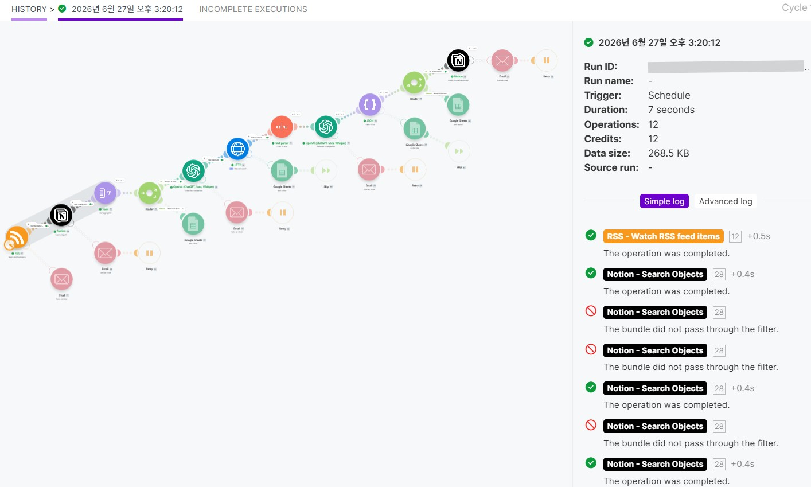

<br>

노션 DB 저장 테이블:

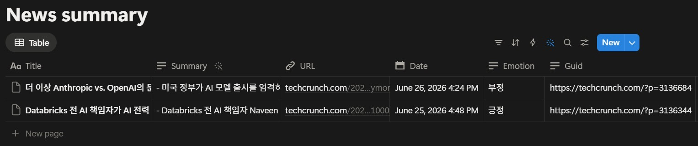

<br>

노션 DB 저장 결과:

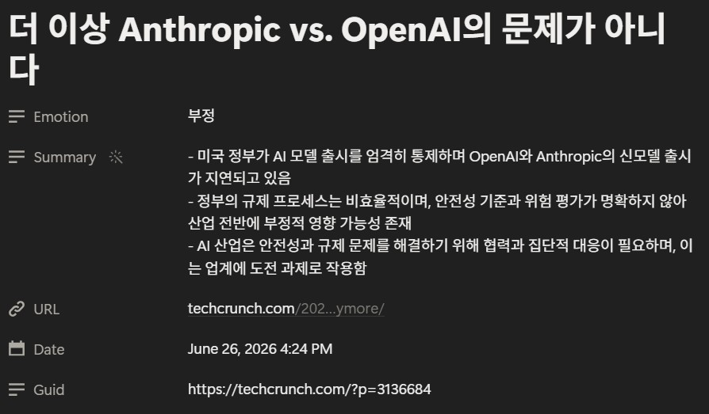

---

## 2. RSS 에러 알림

RSS 에러 상황 테스트: RSS 모듈의 URL란에 없는 주소를 넣음. 예) `https://www.techcrunch.com/fe`

실행 완료:

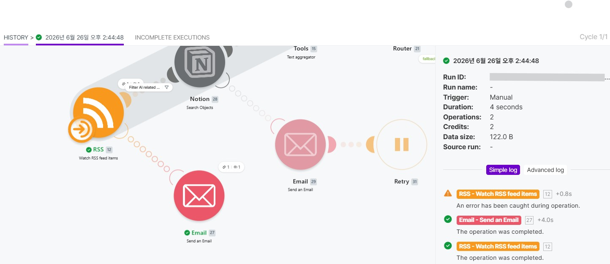

<br>

이메일 전송:

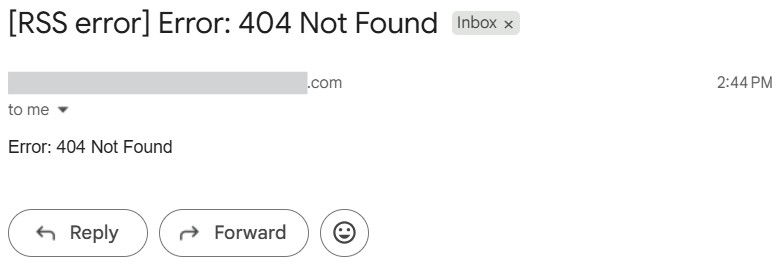

---

## 3. AI 관련 기사 없을 시 구글 시트에 기록

실행 완료:

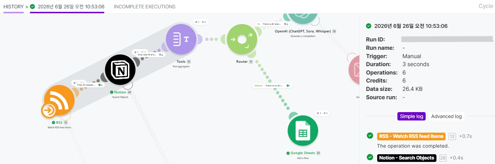

<br>

구글 시트 기록:

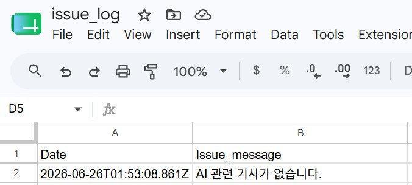

---

## 4. Notion 에러 이메일 알림 후 재시도

노션에 에러가 났을 때 error handler에서 Router를 넣어서 Path A를 치명적인 에러에 이메일을 보내고 재시도, 그리고 Path B를 일반적인 에러에 구글 시트의 issue_log에 넣고 재시도를 하게 해도 되지만, 현 과제를 위해서 간단하게 모든 에러에 이메일을 보내고 재시도를 하게 함.

노션 에러 상황 테스트: Data Source ID를 없는 ID로 넣고 실행.

### <첫 번째 Notion>

실행 완료: 

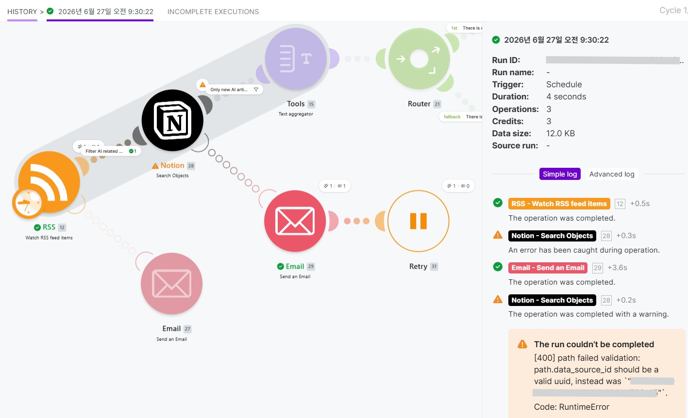

<br>

이메일 전송:

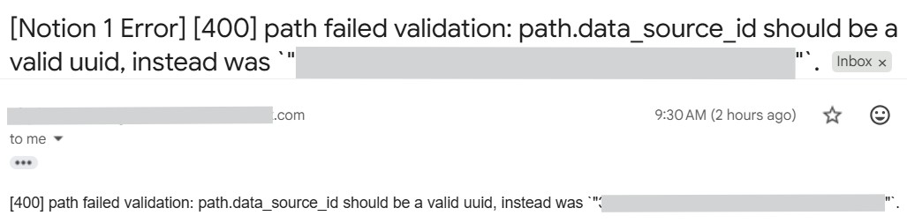

### <두 번째 Notion>

실행 완료:

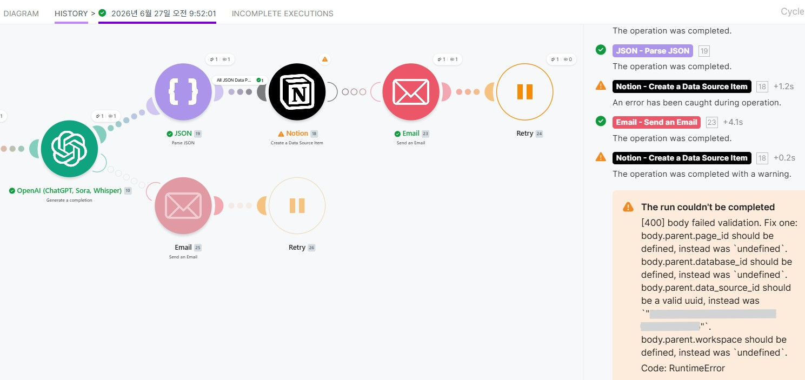

<br>

이메일 전송:

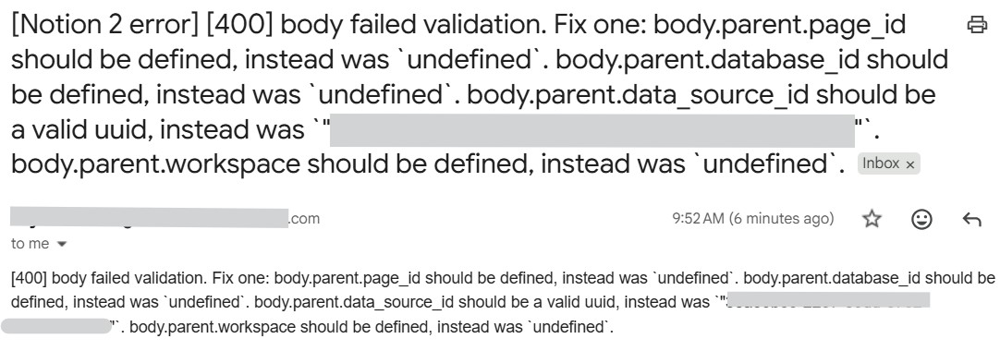

---

## 5. OpenAI 에러 이메일 알림 후 재시도

오픈AI에 에러가 났을 때 error handler에서 Router를 넣어서 Path A를 치명적인 에러에 이메일을 보내고 재시도, 그리고 Path B를 일반적인 에러에 구글 시트의 issue_log에 넣고 재시도를 하게 해도 되지만 현 과제를 위해서 간단하게 모든 에러에 이메일을 보내고 재시도를 하게 함.

오픈AI 에러 상황 테스트: `Model`필드에서 `Map`을 선택하고 없는 GPT모델을 넣음. 예) `gpt-fake-model-12345` 

### <첫 번째 OpenAI>

실행 완료:

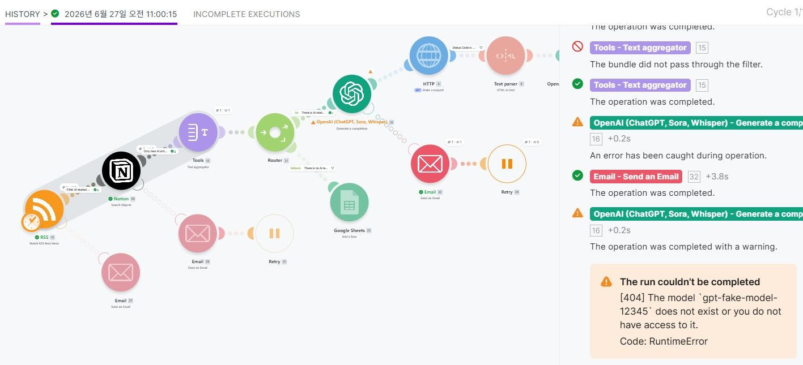

<br>

이메일 전송:

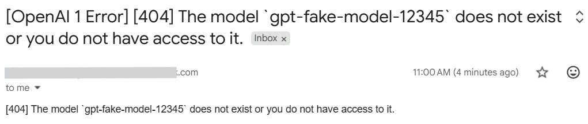

### <두 번째 OpenAI>

실행 완료:

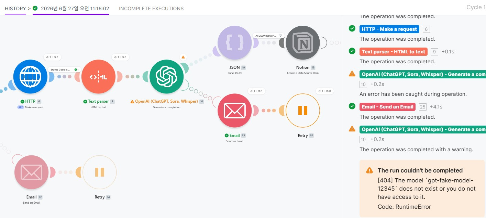

<br>

이메일 전송:

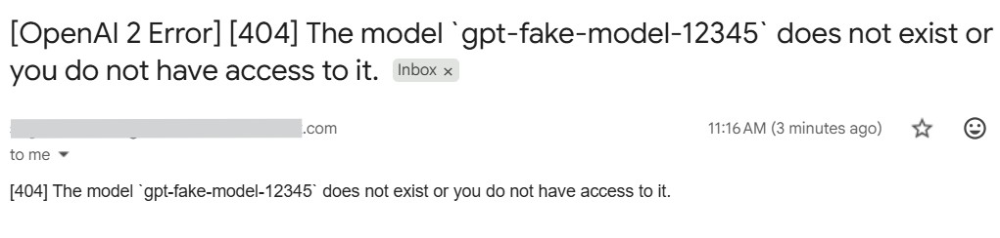

---

## 6. HTTP 에러 구글 시트에 이슈 기록

`HTTP` 에서 에러가 났을 때는 즉각적인 조치가 필요하지 않기 때문에 알림을 보내지 않고 추적 및 감사를 하기 위해 구글 시트에 이슈에 대한 행 삽입. 그리고 `HTTP` -> `Text Parser` 중간에 필터를 사용하여 아래 이미지와 같이 `Status Code` 가 200~299일 때만 다음 모듈(`Text Parser`)로 가게 함.

<figure style="text-align: center;">
  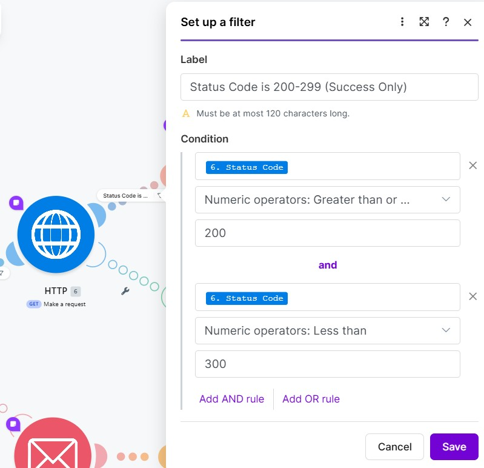
  <figcaption>HTTP 모듈 바로 뒤의 필터 조건. Status Code가 200~299여야 한다.</figcaption>
</figure>

HTTP 에러 상황 테스트: URL을 첫 번째 OpenAI에서 나온 출력이 아닌 `https://doesntexist.com`으로 넣고 실행.

실행 완료:

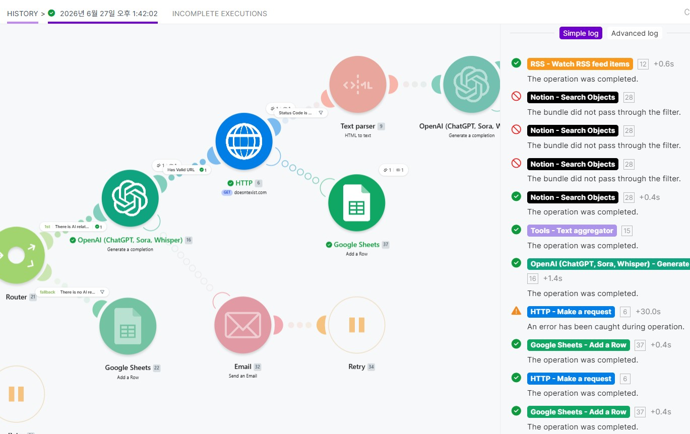

<br>

구글 시트 기록:

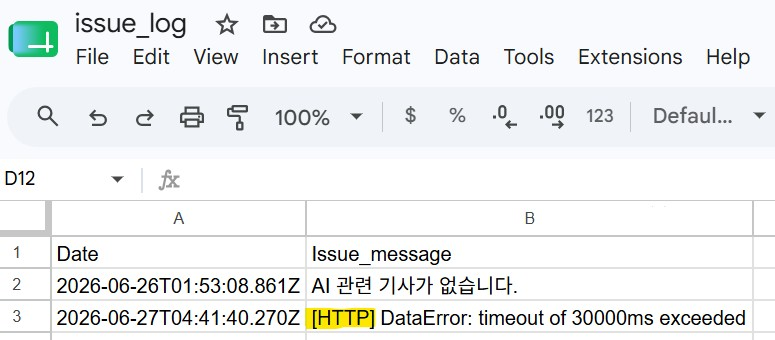

---

## 7. Parse JSON가 JSON형식의 string을 받지 않은 경우 구글 시트에 이슈 기록

`Parse JSON` 에서 에러가 났을 때도 즉각적인 조치가 필요하지 않기 때문에 알림을 보내지 않고 추적 및 감사를 하기 위해 구글 시트에 이슈에 대한 행 삽입.

Parse JSON 에러 상황 테스트: `JSON string`필드에 OpenAI가 출력한 JSON 형식의 답이 아닌 `not-json-you-want`을 넣고 실행.

실행 완료:

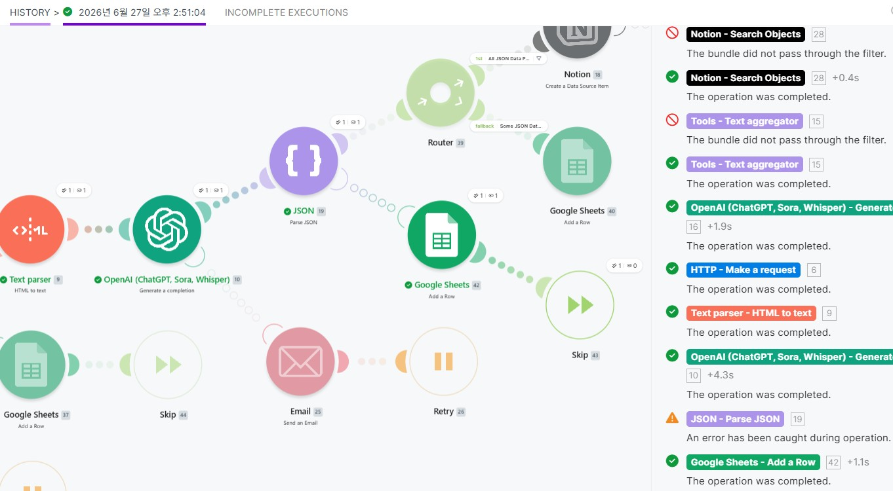

<br>

구글 시트 기록:

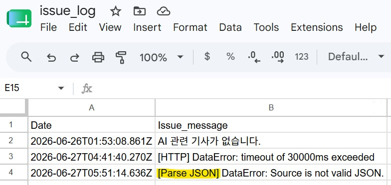

---

## 8. Parse JSON에서 모든 데이터를 받지 않았을 때 구글 시트에 이슈 기록

Parse JSON 상황 테스트: `JSON string`필드에 OpenAI가 출력한 JSON 형식의 답에서 `Summary`를 빼고 실행.

`JSON string` 필드 입력 예:
```
{"Title": "Patronus AI, AI 에이전트 스트레스 테스트용 ‘디지털 월드’ 구축 위해 5,000만 달러 투자 유치","URL": "https://techcrunch.com/2026/06/25/patronus-ai-lands-50m-to-build-digital-worlds-that-stress-test-ai-agents/","Date": "2026-06-25 20:19:25","Emotion": "긍정","Guid": "https://techcrunch.com/?p=3136499"}
```

실행 완료:

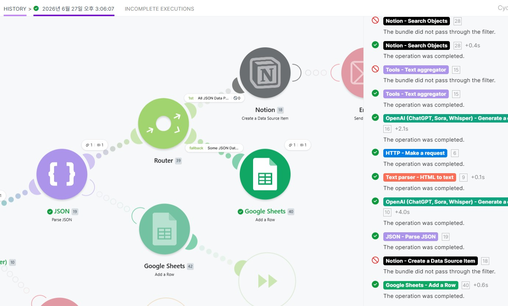

<br>

구글 시트 기록:

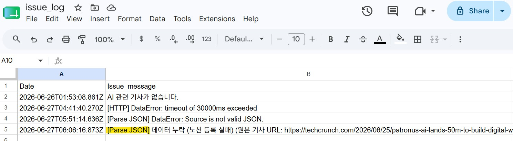

---

## 9. 기사 중복 체크

Feed에서 RSS 를 가져왔으나 노션 데이터베이스에 같은 Guid 항목이 있어서 필터되어 다른 AI기사가 DB에 저장됨.

실행 완료:

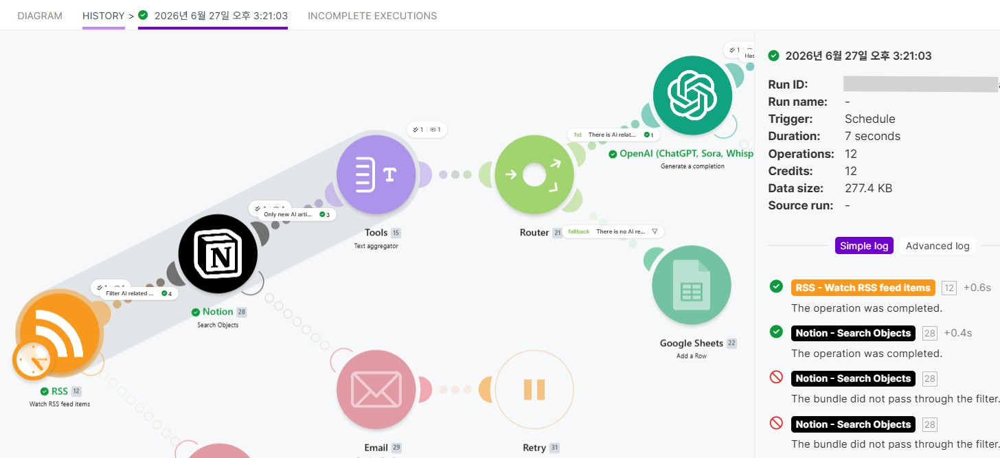

<br>

노션 모듈에서 Guid 체크 output:

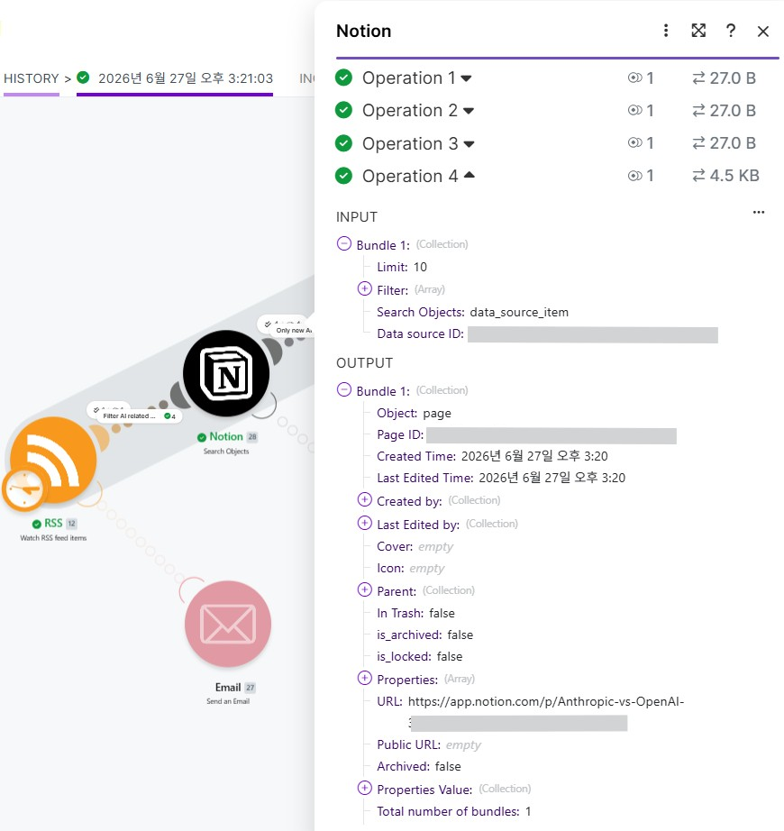

<br>

노션 데이터 베이스에 다른 기사 저장:

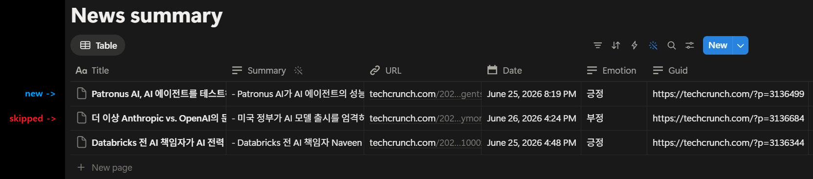

<br>

---


<!--

<font color="red">로그 종류 판단하시고 필요에 따라 정의 변경, 종류 변경 해주세요.</font>

## 접속 에러 알림
* 접속 시도시 실패한 기록 - 연결 실패(인터넷 에러, 잘못된 주소 등)

## 실행 로그 (재실행 로그)
* 워크플로우가 실행된 이력 (성공, 실패 여부 기록이 되면 더욱 좋습니다)
  * 실패 뒤에 실행기록이 쌓이면 그것이 재실행이기 때문에 성공,실패 기록이 들어가면 유리함

-->