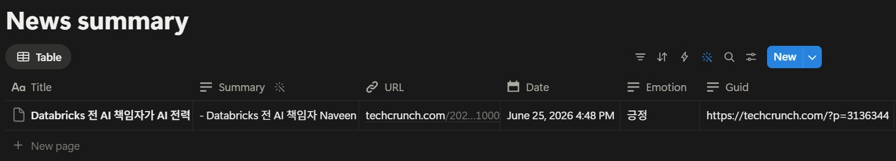
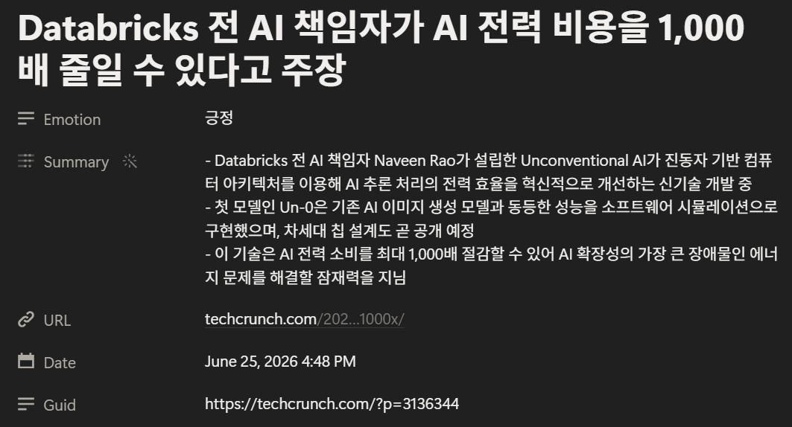
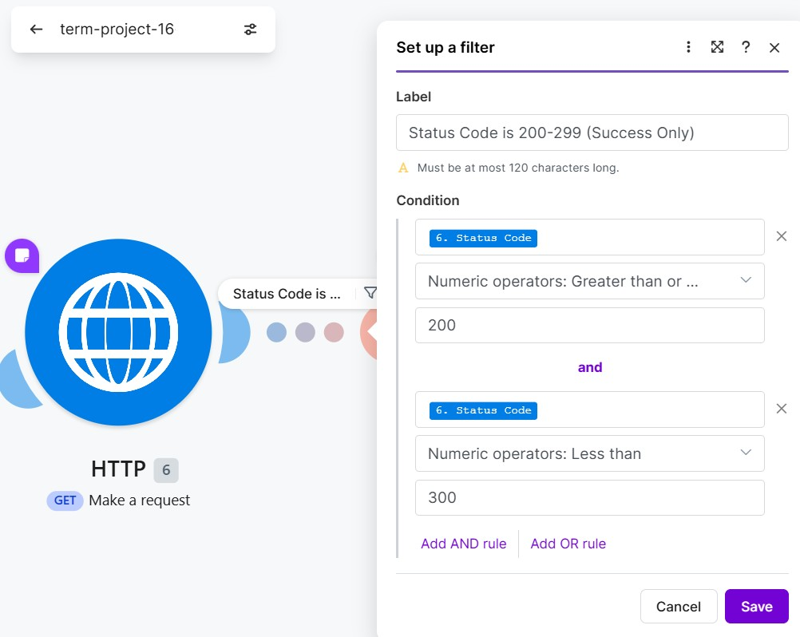

# 각종 실행 로그

로그 종류 판단하시고 필요에 따라 정의 변경, 종류 변경 해주세요.

## 1. 노션 DB에 뉴스 저장

실행 완료:

 

노션 DB 저장 테이블:

 

노션 DB 저장 결과:

---

## 2. RSS 에러 알림

실행 완료:

 

이메일 전송:

---

## 3. AI 관련 기사 없을 시 구글 시트에 기록

실행 완료:

 

구글 시트 기록:

---

## 4. Notion 에러 이메일 알림 후 재시도

노션 에러 상황 테스트: Data Source ID를 없는 ID로 넣고 실행.

### <첫 번째 Notion>

실행 완료: 

 

이메일 전송:

### <두 번째 Notion>

실행 완료:

 

이메일 전송:

---

## 5. OpenAI 에러 이메일 알림 후 재시도

오픈AI 에러 상황 테스트: `Model`필드에서 `Map`을 선택하고 없는 GPT모델을 넣음. 예) `gpt-fake-model-12345` 

### <첫 번째 OpenAI>

실행 완료:

 

이메일 전송:

### <두 번째 OpenAI>

실행 완료:

 

이메일 전송:

---

## 6. HTTP 에러는 filter 사용

HTTP 에서 에러가 났을 때 알림을 보내지 않고 간단하게 필터를 사용하여 `Status Code` 가 200~299일 때만 다음 모듈(Text Parser)로 가게 함.

---

## 접속 에러 알림
* 접속 시도시 실패한 기록 - 연결 실패(인터넷 에러, 잘못된 주소 등)

## 중복 로그 (-> 현재 기록하고 있지 않음)
* Feed에서 RSS 를 가져왔으나 노션 데이터베이스에 같은 Guid 항목이 있어서 필터된 기록 

## 실행 로그 (재실행 로그)
* 워크플로우가 실행된 이력 (성공, 실패 여부 기록이 되면 더욱 좋습니다)
  * 실패 뒤에 실행기록이 쌓이면 그것이 재실행이기 때문에 성공,실패 기록이 들어가면 유리함  * 

캡쳐 이미지

## 데이터 없음 (Empty) 로그
* Feed를 호출했으나, Filter 에 추출된 데이터가 없거나, 값이 비어있는 경우