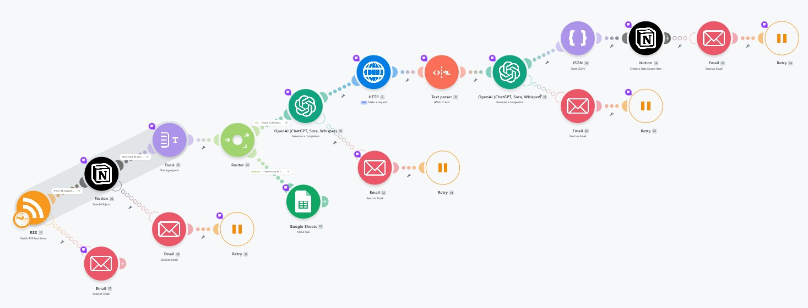

# 워크플로우 구조 (Make)

### 1. 스크린샷



---

# 각 단계별 역할과 연결 구조를 설명하는 문서

## 1. 워크플로우 흐름도

```text
▼ [1. RSS 트리거] (에러 발생 시 ➔ 📧 이메일 알림)
│
└── ⚡ (Filter 1: AI 관련 키워드 체크)
    │
    ▼ [2. Notion 중복 검사] (Guid 기준 조회)
    │
    └── ⚡ (Filter 2: Notion 검색 결과 Total nr of bundles = 0 일 때만 통과)
        │
        ▼ [3. Text Aggregator] (신규 AI 기사들을 하나의 텍스트로 합산)
        │
        ▼ [4. 라우터 (Router) 분기]
            │
            ├─── [Path A] 금일 AI 기사가 존재하는 경우
            │     │
            │     ▼ [5. OpenAI (선택)] ➔ 오늘의 Top 기사 URL 1개 선정
            │     │      └─ (에러 발생 시 ➔ 📧 이메일 알림 + 🔄 Retry 2회)
            │     │
            │     ▼ [6. HTTP (크롤링)] ➔ 웹페이지 원시 HTML 소스 다운로드
            │     │
            │     ▼ [7. Text Parser] ➔ HTML 태그 제거 및 순수 텍스트 추출
            │     │
            │     ▼ [8. OpenAI (요약)] ➔ 전문 분석 후 최대 3개 불릿 포인트 요약 & JSON 출력
            │     │      └─ (에러 발생 시 ➔ 📧 이메일 알림 + 🔄 Retry 2회)
            │     │
            │     ▼ [9. JSON 파싱] ➔ JSON 텍스트를 개별 데이터 변수로 분해
            │     │
            │     ▼ [10. Notion 저장] ➔ DB 내 Title, Summary 등 최종 저장 완료 ✨
            │
            └─── [Path B] Fallback: 금일 AI 기사가 없는 경우
                  │
                  ▼ [Google Sheets (로그 기록)] ➔ "AI 관련 기사가 없습니다" 행 추가
```

## 2. 워크플로우 단계별 설명

### [1단계]: 데이터 수집 및 1차 필터링

| 모듈명 | 모듈 설명 | 역할 | 단계 산출물 |
| --- | --- | --- | --- |
| **[1] RSS** - Watch RSS Feed items | TechCrunch 등 지정된 RSS 피드를 실시간/주기적으로 감시 | 새로운 뉴스 기사가 발행되면 데이터를 가져오는 트리거 역할 | 새 뉴스 기사 데이터 (Title, URL, Description, Guid 등) |
| **(Filter 1)** - AI 관련 기사 필터 | 기사 내용에 AI 관련 키워드가 포함되어 있는지 검사 | AI와 관련 없는 일반 테크 뉴스를 1차로 걸러냄 | 필터 조건을 충족한 AI 관련 기사 데이터 |

* **🚨 에러 핸들러 (Error Handler):** RSS 피드 연결 실패 등 에러 발생 시 **[Email - Send an Email]** 모듈이 실행되어 관리자에게 에러 메시지 알림을 전송.

---

### [2단계]: 중복 제거 및 데이터 통합

| 모듈명 | 모듈 설명 | 역할 | 단계 산출물 |
| --- | --- | --- | --- |
| **[2] Notion** - Search Objects | Notion 데이터베이스에서 현재 기사의 `Guid`를 검색 | 이미 예전에 노션에 저장했던 중복 기사인지 확인. | Notion 검색 결과 (Bundle 수) |
| **(Filter 2)** - 중복 제거 필터 | Notion 검색 결과의 총 Bundle 수가 **0일 때만** 통과시킴 | 이미 노션에 있는 기사는 제외하고, **새로운 기사만** 다음 단계로 보냄 | 노션에 존재하지 않는 신규 AI 기사 데이터 |
| **[3] Tools** - Text Aggregator | 여러 개로 나뉜 신규 AI 기사들을 하나의 텍스트 템플릿으로 묶음 | 여러 번 실행될 OpenAI 호출을 1번으로 줄여 비용 절감 | 모든 신규 AI 기사가 누적된 하나의 통합 텍스트 변수 (`text`) |

---

### [3단계]: 조건별 경로 분기 (Router)

| 모듈명 | 모듈 설명 | 역할 | 단계 산출물 |
| --- | --- | --- | --- |
| **[4] Router** - 라우팅 분기 | 통합된 텍스트(`text`)의 존재 여부에 따라 경로를 나눔 | 오늘 처리할 AI 뉴스가 있는 경우와 없는 경우의 동작을 분기 | 조건에 따른 경로 배정 |
| **Path A Filter** - AI 기사 있음 | `text` 변수가 비어있지 않은 경우 진행 | 메인 요약 및 저장 프로세스 가동 | 통합 기사 텍스트 전달 |
| **Path B** - Fallback (기사 없음) | Fallback(Yes)으로 설정되어, Path A 조건에 맞지 않을 때 자동 실행 | **[Google Sheets - Add a Row]** 모듈로 이동하여 금일 날짜와 함께 *"AI 관련 기사가 없습니다"* 메시지를 기록 | 구글 시트 내 로그 행 추가 완료 |

---

### [4단계]: 핵심 기사 선정 및 본문 크롤링 (Path A 진행 시)

| 모듈명 | 모듈 설명 | 역할 | 단계 산출물 |
| --- | --- | --- | --- |
| **[5] OpenAI** - Generate a completion | 통합된 기사 리스트 중 가장 중요도가 높은 기사 1개 선정 | AI가 가치 판단을 통해 오늘 꼭 읽어야 할 탑 기사의 URL만 딱 하나 추출함 | 선별된 기사의 URL |
| **[6] HTTP** - Make a request | OpenAI가 선택한 기사의 URL 링크로 웹 요청을 보냄 | 해당 뉴스 웹페이지에 직접 방문하여 데이터를 긁어옴 | 웹페이지의 원시 HTML 소스 코드 |
| **[7] Text Parser** - HTML to text | 다운로드한 HTML 코드에서 텍스트만 추출 | `<script>`, `<div>` 등 불필요한 태그를 지우고 기사 본문 텍스트만 남김 | 기사 본문 텍스트 |

---

### [5단계]: AI 심층 요약 및 최종 저장

| 모듈명 | 모듈 설명 | 역할 | 단계 산출물 |
| --- | --- | --- | --- |
| **[8] OpenAI** - Generate a completion | 기사 본문을 읽고 3개의 불릿 포인트 요약 및 메타데이터를 생성 | 구조화된 분석을 수행하고, 프로그래밍 처리가 쉽도록 **JSON 형태**로 결과를 출력 | Title, Summary, URL 등이 포함된 JSON 텍스트 |
| **[9] JSON** - Parse JSON | OpenAI가 출력한 JSON 텍스트를 구조화된 데이터로 파싱 | 텍스트 덩어리를 Notion 필드에 각각 맵핑할 수 있는 개별 변수로 변환 | 분리된 데이터 필드 (Title, Summary, URL 등) |
| **[10] Notion** - Create a Data Source Item | 파싱된 데이터를 Notion DB의 각 속성(Column)에 맞게 입력 | 대시보드에 최종 최적화된 형태로 오늘의 AI 뉴스를 저장 | **노션 데이터베이스 새 행 생성 완료** |

---

### [에러 처리]

**Notion 모듈(2, 10번) & OpenAI 모듈(5, 8번) 공통 적용:**

* **1차 방어 (알림):** 외부 서버 연동 에러(Timeout, API 한도 초과, 인증 만료 등) 발생 시, 관리자에게 상황을 공유하는 **[Email - Send an Email]** 알림 발송.
* **2차 방어 (재시도):** 이메일 발송 후 즉시 **[Retry]** 모듈이 가동되어 **2회 재시도**를 수행. 이를 통해 일시적인 트래픽 폭주나 네트워크 오류로 인해 전체 자동화가 멈추는 현상을 방지. 